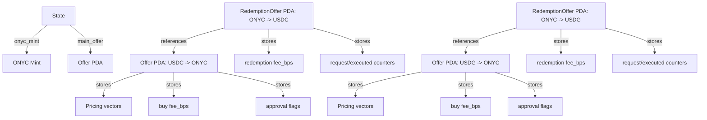
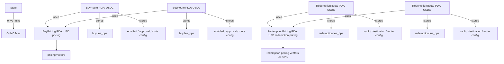
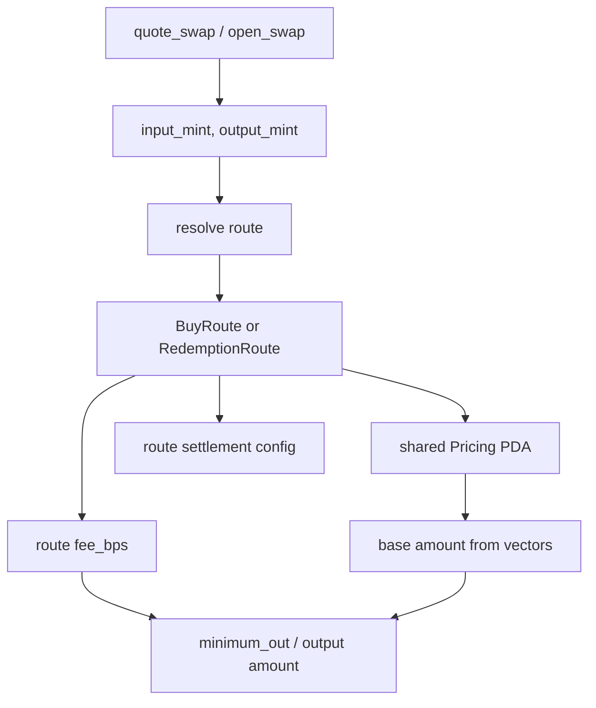

# Pricing Model Graphs

## Current Model

### Problems

- USDC and USDG can share the same price curve, but pricing vectors are duplicated.
- Updating pricing requires updating multiple offers.
- Route-specific fee and shared pricing are stored in the same object.
- Redemption pricing is modeled through `RedemptionOffer`, even when conceptually it is just sell pricing for a token.
- `open_swap` and `quote_swap` are forced to work through legacy `Offer` semantics.

## Proposed Model

## Quote / Swap Resolution Flow

## Why This Is Better

- Shared pricing is updated once.
- Fees can still differ per asset pair.
- New assets can be added by creating routes instead of duplicating full offers.
- `quote_swap` becomes: resolve route, load pricing, compute base amount, apply route fee.
- `open_swap` can use the same route resolution model and then execute settlement based on route config.
