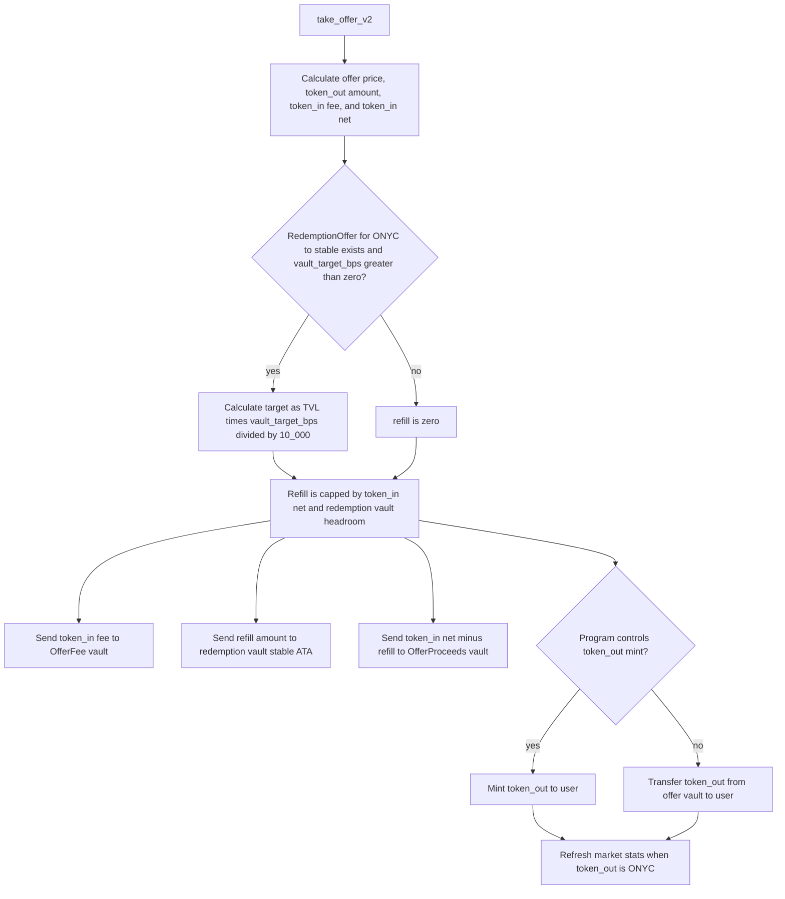
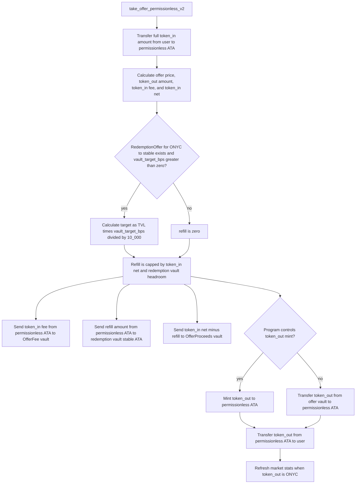
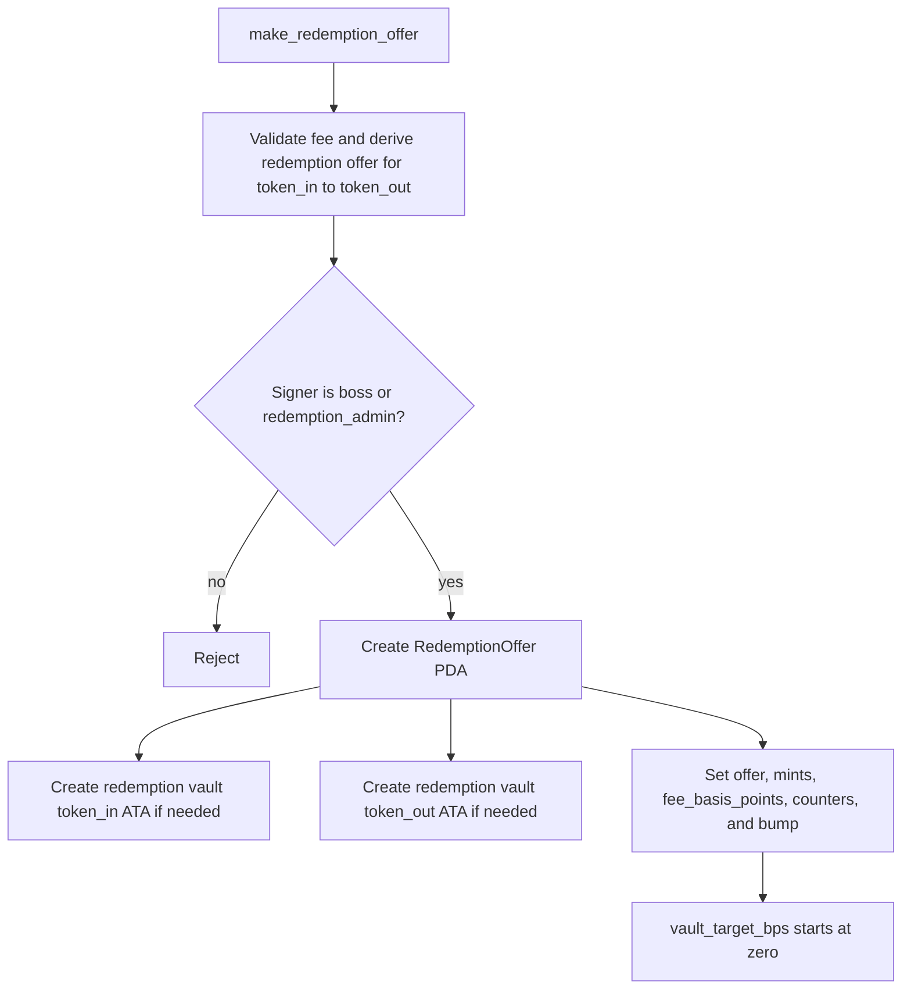
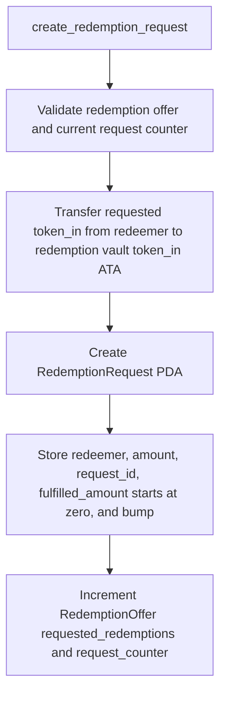
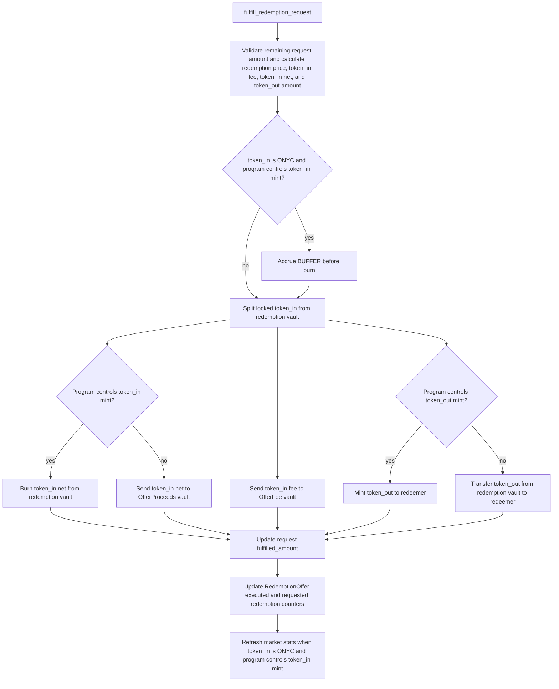
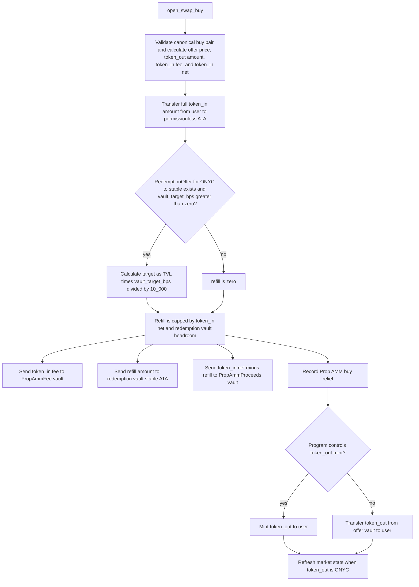
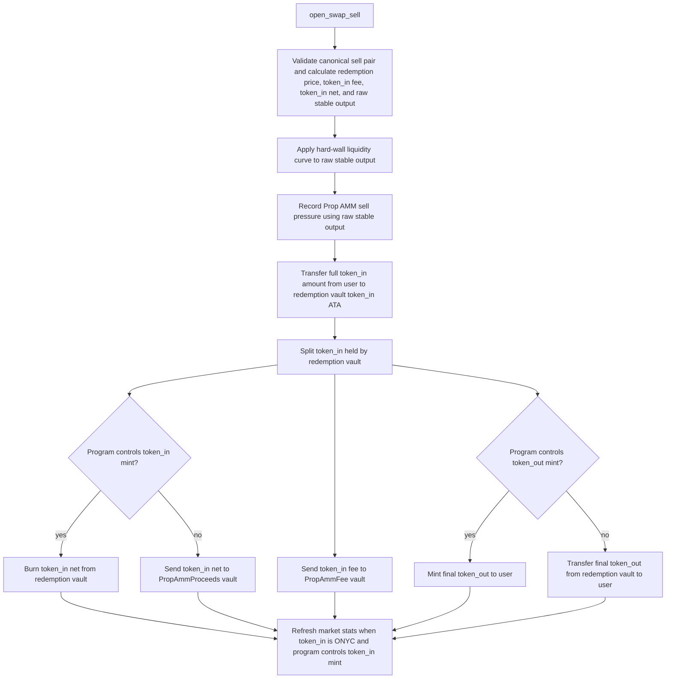

# Instruction Token Flows

This document shows one end-to-end routing flow per instruction. Each flow starts with calculation, then decisions, then token splits and final updates.

`vault_target_bps` lives on `RedemptionOffer`. It defaults to `0`, which means stable inflow does not refill the redemption vault and instead goes fully to proceeds.

## `take_offer_v2`

## `take_offer_permissionless_v2`

## `make_redemption_offer`

## `create_redemption_request`

## `fulfill_redemption_request`

## `open_swap_buy`

## `open_swap_sell`

