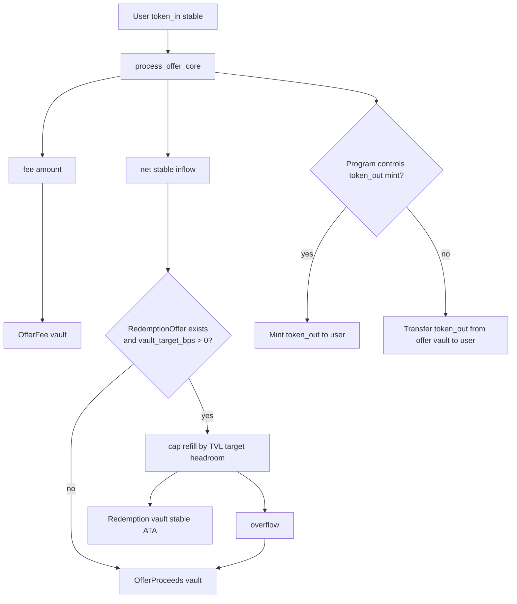
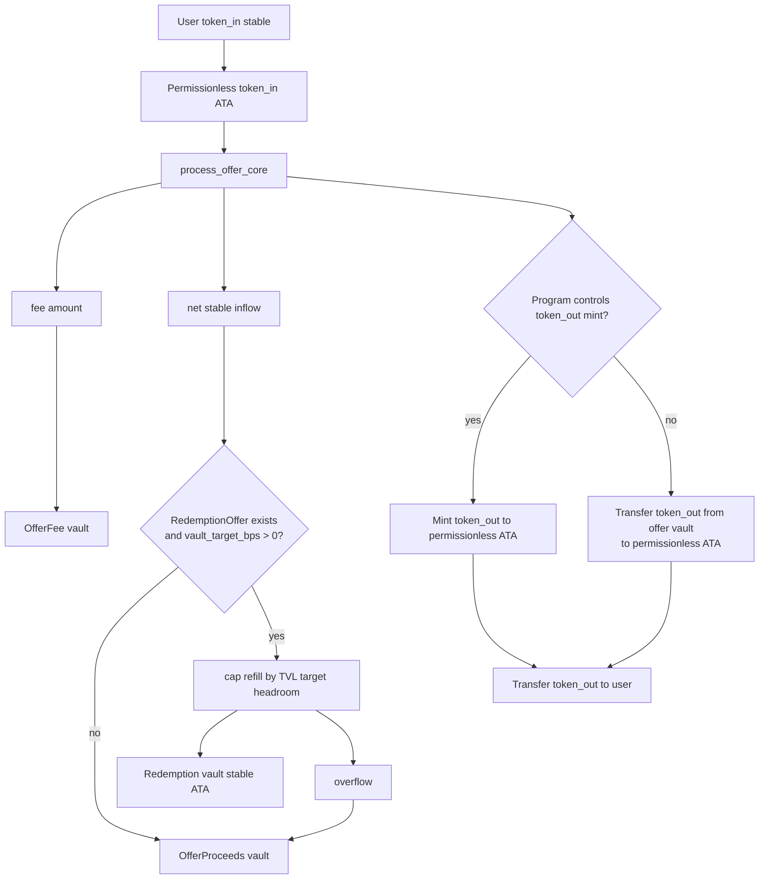
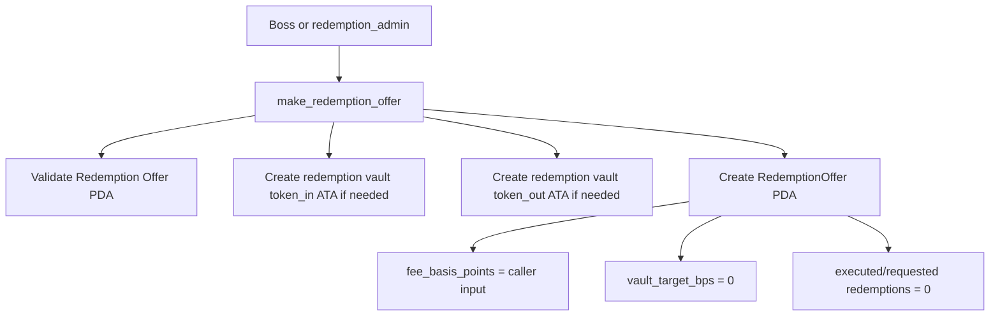
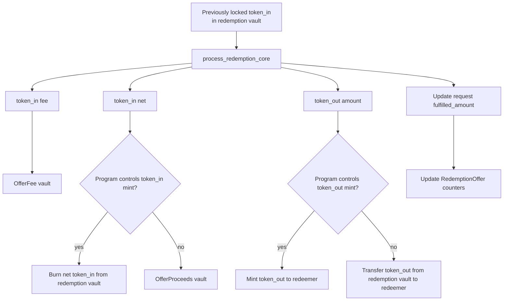
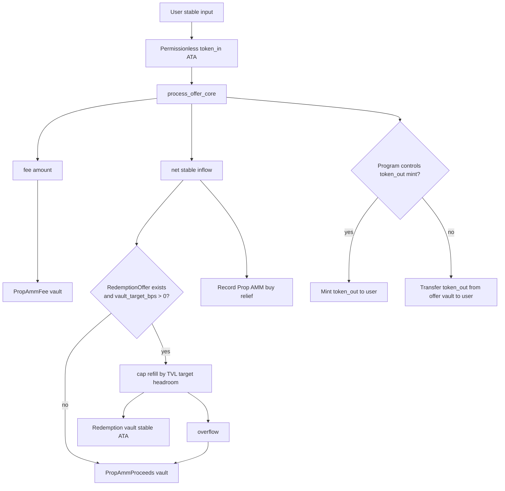
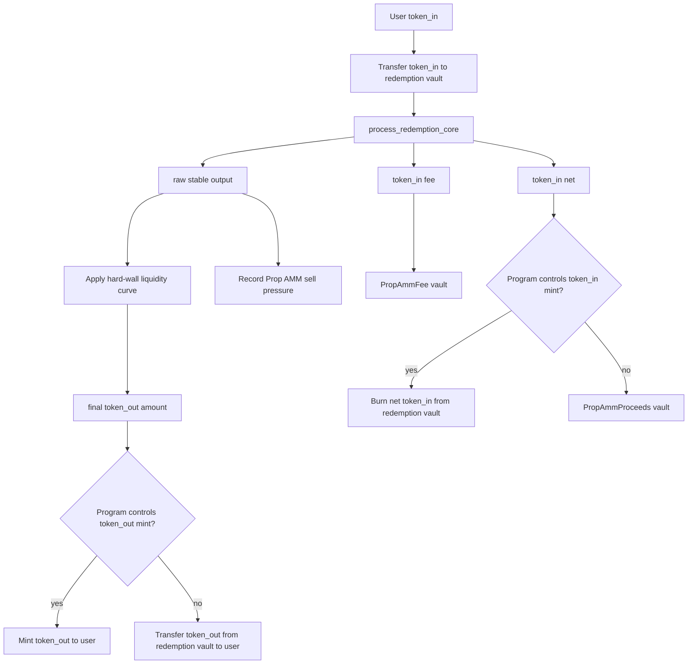

# Token Flow Routing

This page summarizes token routing after the redemption vault target changes.

Key rule: net stable inflow from `take_offer_v2`, `take_offer_permissionless_v2`, and Prop AMM buy refills the redemption vault only when the `RedemptionOffer` exists and `vault_target_bps > 0`. `make_redemption_offer` initializes `vault_target_bps = 0`, so the default behavior sends all net stable inflow to proceeds.

The refill cap is:

```text
target = TVL * vault_target_bps / 10_000
refill = min(net_stable_inflow, max(0, target - current_redemption_vault_balance))
overflow = net_stable_inflow - refill
```

Fees are never part of the refill calculation. They route to the corresponding fee vault.

## `take_offer_v2`



## `take_offer_permissionless_v2`



## Redemption Offer Creation



## Redemption Fulfillment



## Prop AMM Buy



## Prop AMM Sell


